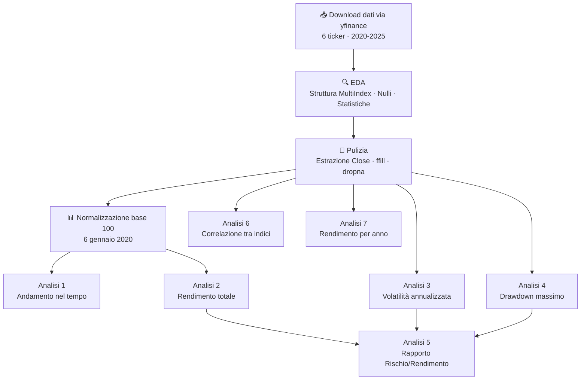
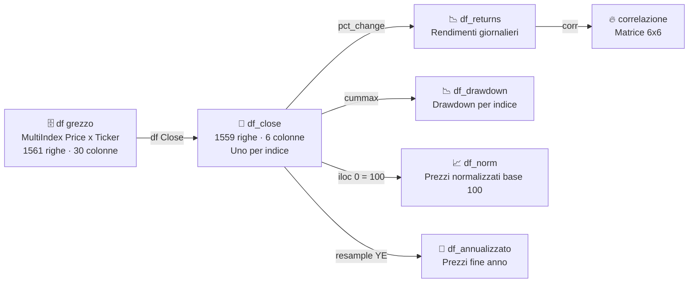

# 📈 Analisi Comparativa Indici Azionari Globali


Analisi esplorativa e comparativa dei principali indici azionari globali nel periodo 2020–2025, realizzata come progetto di portfolio nell'ambito di un percorso di formazione in Data Analysis.

---

## 📦 Fonte dei dati

I dati sono scaricati in tempo reale tramite la libreria **yfinance**, che interroga le API di Yahoo Finance.

```python
import yfinance as yf
df = yf.download(tickers, start="2020-01-01", end="2025-12-31")
```

| Attributo | Dettaglio |
|---|---|
| Periodo coperto | 6 gennaio 2020 – 30 dicembre 2025 |
| Righe totali | 1.559 giorni di borsa |
| Granularità | Giornaliera per indice |
| Aggiornamento | Real-time via yfinance |

---

## 🌍 Indici analizzati

| Indice | Paese | Ticker |
|---|---|---|
| S&P 500 | 🇺🇸 USA | `^GSPC` |
| Nikkei 225 | 🇯🇵 Giappone | `^N225` |
| DAX | 🇩🇪 Germania | `^GDAXI` |
| FTSE MIB | 🇮🇹 Italia | `FTSEMIB.MI` |
| CAC 40 | 🇫🇷 Francia | `^FCHI` |
| FTSE 100 | 🇬🇧 Regno Unito | `^FTSE` |

---

## 🔄 Pipeline del progetto



---

## 🗃️ Note sulla struttura dei dati



> ⚠️ yfinance restituisce un **MultiIndex** sulle colonne (Price × Ticker). Per l'analisi viene estratto solo il livello `Close` e i ticker vengono rinominati con i nomi estesi degli indici.

---

## 🎯 Analisi effettuate

### 1. Andamento nel tempo
Prezzi normalizzati a base 100 (6 gennaio 2020) per rendere confrontabili indici su scale diverse. Il grafico evidenzia il crash COVID di marzo 2020 e le successive divergenze di performance.

### 2. Rendimento totale

| Indice | Rendimento 2020–2025 |
|---|---|
| 🥇 Nikkei 225 | +116.94% |
| 🥈 S&P 500 | +112.44% |
| 🥉 FTSE MIB | +90.60% |
| DAX | +86.57% |
| CAC 40 | +35.83% |
| FTSE 100 | +31.23% |

### 3. Volatilità annualizzata
Calcolata come deviazione standard dei rendimenti giornalieri moltiplicata per √252 (giorni di borsa annui), standard in ambito finanziario.

| Indice | Volatilità |
|---|---|
| FTSE MIB | 21.53% |
| Nikkei 225 | 21.45% |
| S&P 500 | 20.58% |
| DAX | 20.02% |
| CAC 40 | 19.60% |
| FTSE 100 | 16.37% |

### 4. Drawdown massimo
Tutti i minimi si concentrano tra il 12 e il 23 marzo 2020 — il picco del panico sui mercati nella prima fase della pandemia COVID-19.

| Indice | Drawdown massimo | Data |
|---|---|---|
| FTSE MIB | -41.54% | 12/03/2020 |
| DAX | -38.78% | 18/03/2020 |
| CAC 40 | -38.56% | 18/03/2020 |
| FTSE 100 | -34.93% | 23/03/2020 |
| S&P 500 | -33.92% | 23/03/2020 |
| Nikkei 225 | -31.27% | 19/03/2020 |

### 5. Rapporto Rischio/Rendimento
S&P 500 e Nikkei 225 offrono il miglior profilo rischio/rendimento del paniere. CAC 40 e FTSE 100 sono i meno efficienti: basso rendimento con volatilità nella media.

| Indice | Rendimento/Volatilità |
|---|---|
| S&P 500 | 5.46 |
| Nikkei 225 | 5.45 |
| DAX | 4.32 |
| FTSE MIB | 4.21 |
| FTSE 100 | 1.91 |
| CAC 40 | 1.83 |

### 6. Correlazione tra indici
Gli indici europei (FTSE MIB, CAC 40, FTSE 100, DAX) sono altamente correlati tra loro (0.80–0.93), muovendosi quasi all'unisono. Il Nikkei 225 è il più decorrelato (0.18–0.35), rendendolo il miglior strumento di diversificazione del paniere per un investitore europeo.

| | FTSE MIB | CAC 40 | FTSE 100 | DAX | S&P 500 | Nikkei 225 |
|---|---|---|---|---|---|---|
| FTSE MIB | 1.00 | 0.89 | 0.80 | 0.89 | 0.52 | 0.30 |
| CAC 40 | 0.89 | 1.00 | 0.85 | 0.93 | 0.53 | 0.34 |
| FTSE 100 | 0.80 | 0.85 | 1.00 | 0.82 | 0.50 | 0.34 |
| DAX | 0.89 | 0.93 | 0.82 | 1.00 | 0.54 | 0.35 |
| S&P 500 | 0.52 | 0.53 | 0.50 | 0.54 | 1.00 | 0.18 |
| Nikkei 225 | 0.30 | 0.34 | 0.34 | 0.35 | 0.18 | 1.00 |

### 7. Rendimento per anno
Il 2022 è l'unico anno negativo per quasi tutti gli indici (rialzo tassi Fed, inflazione, guerra in Ucraina). Il FTSE 100 è l'unica eccezione (+1%), grazie alla composizione difensiva su energia e materie prime. Il 2025 vede il FTSE MIB come miglior performer (+31%).

| Anno | FTSE MIB | CAC 40 | FTSE 100 | DAX | S&P 500 | Nikkei 225 |
|---|---|---|---|---|---|---|
| 2021 | +23.00% | +28.85% | +14.30% | +15.79% | +26.89% | +4.91% |
| 2022 | -13.31% | -9.50% | +0.91% | -12.35% | -19.44% | -9.37% |
| 2023 | +28.03% | +16.52% | +3.78% | +20.31% | +24.23% | +28.24% |
| 2024 | +12.63% | -2.15% | +5.69% | +18.85% | +23.31% | +19.22% |
| 2025 | +31.47% | +10.67% | +21.63% | +23.01% | +17.25% | +26.18% |

---

## 🛠️ Tecnologie utilizzate

- **Python 3.13**
- **yfinance** — scaricamento dati finanziari
- **pandas** — manipolazione e analisi dei dati
- **numpy** — calcoli statistici (√252)
- **matplotlib** — visualizzazioni
- **seaborn** — heatmap correlazione

---

## 📁 File

| File | Descrizione |
|---|---|
| `Analisi indici azionari 20200101-20250130.ipynb` | Notebook principale con codice, output e commenti |
| `README.md` | Questo file |
