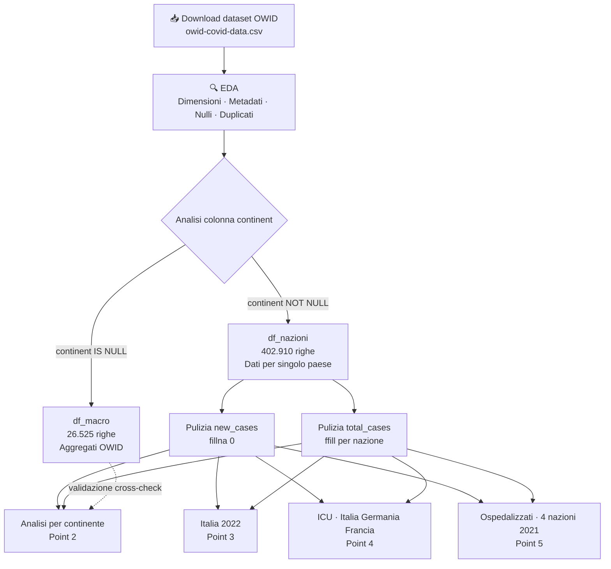
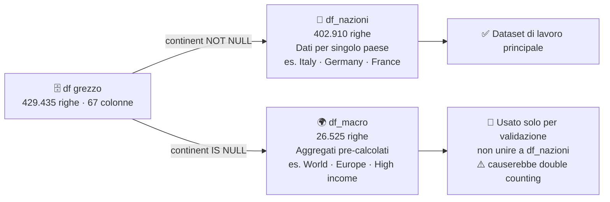

# 🦠 Analisi Diffusione COVID-19

Analisi esplorativa e reportistica sui dati della pandemia di COVID-19, realizzata come progetto di portfolio nell'ambito di un percorso di formazione in Data Analysis.

---

## 📦 Fonte dei dati

I dati utilizzati sono raccolti e curati da **Our World in Data (OWID)** e sono disponibili al seguente indirizzo:

🔗 [owid-covid-data.csv](https://github.com/owid/covid-19-data/tree/master/public/data)

| Attributo | Dettaglio |
|---|---|
| Periodo coperto | Gennaio 2020 – Agosto 2024 |
| Righe totali | 429.435 |
| Colonne totali | 67 |
| Granularità | Giornaliera per paese |
| Aggiornamento | Periodico |

---

## 🔄 Pipeline del progetto

---

## 🗃️ Struttura del dataset

---

## 🎯 Obiettivi dell'analisi

1. Verificare le dimensioni del dataset e i relativi metadati
2. Trovare, per ogni continente, il numero di casi dall'inizio della pandemia e la percentuale rispetto al totale mondiale
3. Analizzare i dati dell'Italia nel 2022 tramite grafici sull'evoluzione dei casi totali e dei nuovi casi settimanali
4. Confrontare tramite boxplot i pazienti in terapia intensiva (ICU) di Italia, Germania e Francia da maggio 2022 ad aprile 2023
5. Analizzare il totale dei pazienti ospedalizzati di Italia, Germania, Francia e Spagna nel 2021

---

## 🗂️ Struttura del notebook

### 1. Dimensioni del dataset e metadati
Caricamento del dataset da GitHub, analisi delle dimensioni, dei tipi di dato e dei valori nulli.  
Identificazione delle colonne con alta percentuale di dati mancanti (>50%), tipica di dataset epidemiologici con copertura non uniforme tra paesi.

### 2. EDA — Analisi Esplorativa

#### Colonne `continent` e `location`
Il dataset mescola due livelli di granularità differenti:

- **Dati puntuali** (righe con `continent` non nullo) → singoli paesi
- **Dati aggregati** (righe con `continent` nullo) → continenti, fasce di reddito, raggruppamenti geopolitici pre-calcolati da OWID

Il dataset viene separato in:
- `df_nazioni` → dataset di lavoro principale (402.910 righe)
- `df_macro` → aggregati OWID, usati esclusivamente come riferimento di validazione (26.525 righe)

> ⚠️ I due dataset **non vengono mai uniti**: `df_macro` contiene già la somma dei paesi sottostanti, unirli causerebbe double counting.

#### Colonne `new_cases` e `total_cases`

| Colonna | Tipo | Logica di pulizia |
|---|---|---|
| `new_cases` | **Flusso** — nuovi casi nel periodo | NaN → `fillna(0)` |
| `total_cases` | **Stock** — valore cumulato progressivo | NaN → `ffill()` per nazione, poi `fillna(0)` |

### 3. Casi per continente
Aggregazione bottom-up su `df_nazioni`: per ogni paese si prende l'ultimo valore cumulato di `total_cases`, poi si sommano i paesi per continente.

| Continente | Casi totali | % sul totale mondiale |
|---|---|---|
| Africa | 13.145.380 | 1,69% |
| Asia | 301.499.099 | 38,86% |
| Europe | 252.916.868 | 32,60% |
| North America | 124.492.666 | 16,05% |
| Oceania | 15.003.352 | 1,93% |
| South America | 68.809.418 | 8,87% |

### 4. Italia 2022 — Evoluzione casi
Filtro sui dati italiani del 2022 con esclusione dei giorni senza rilevazione (`new_cases == 0`), ottenendo ~52 osservazioni settimanali.

- **Line chart** → `total_cases` (stock cumulato, crescita monotonica)
- **Bar chart** → `new_cases` (flusso settimanale, evidenzia le ondate)

### 5. Pazienti ICU — Italia, Germania, Francia (mag 2022 / apr 2023)
Confronto tramite boxplot della distribuzione dei pazienti in terapia intensiva (`icu_patients`).  
I valori nulli (~29–34% per Germania e Francia) vengono gestiti con `ffill()` per nazione.

**In valori assoluti:** Germania e Francia ~950–1000 pazienti (mediana), Italia ~230.  
**Normalizzando per milione di abitanti:** la Francia supera la Germania (mediana ~14 vs ~12 per milione), mentre l'Italia rimane la nazione con il minor carico (~4 per milione).

### 6. Pazienti ospedalizzati — Italia, Germania, Francia, Spagna (2021)
Analisi del totale annuale dei pazienti ospedalizzati (`hosp_patients`).

| Nazione | Pazienti ospitalizzati 2021 |
|---|---|
| Francia | ~6.000.000 |
| Italia | ~4.400.000 |
| Spagna | ~2.400.000 |
| Germania | — dati non disponibili |

La Germania è esclusa dall'analisi: la colonna `hosp_patients` risulta completamente assente per tutto il 2021 (0 valori su 365 giorni), un'assenza strutturale non colmabile con `ffill()`.

---

## 🛠️ Tecnologie utilizzate

- **Python 3.13**
- **pandas** — manipolazione e pulizia dei dati
- **matplotlib** — visualizzazioni

---

## 📁 File

| File | Descrizione |
|---|---|
| `Esercitazione_Finale.ipynb` | Notebook principale con codice, output e commenti |
| `README.md` | Questo file |
